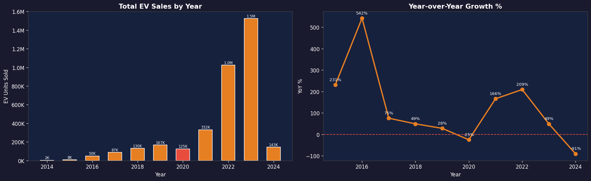
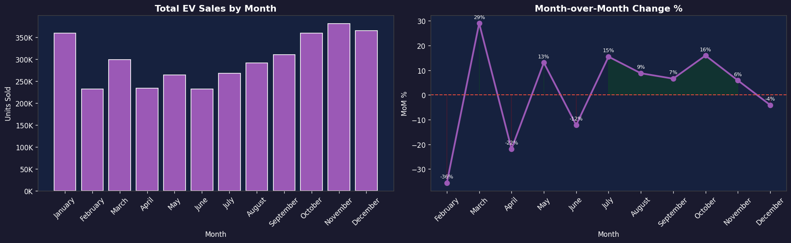
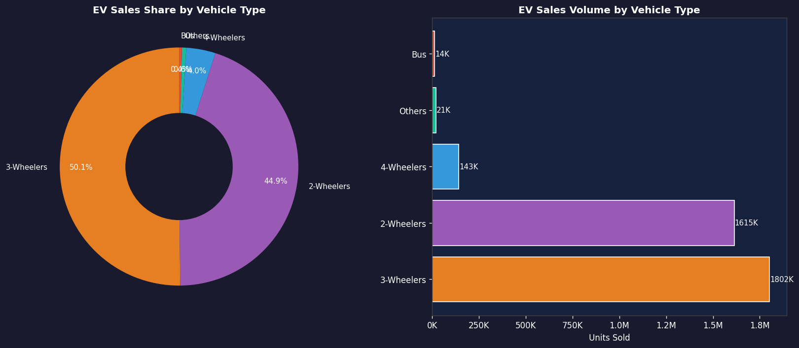
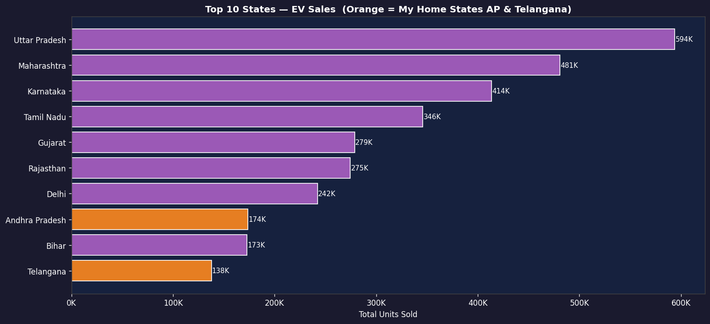
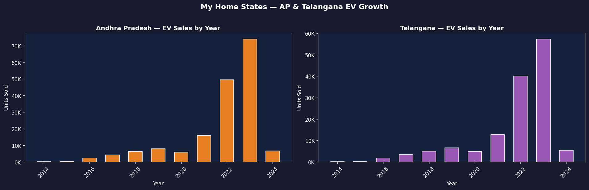

# Electric Vehicle Sales Analysis — India (2014–2024)

**Author:** Yeluri Venkata Vishnu Vardhan

## About This Project
I built this project to explore EV sales trends across India, with a personal focus on
Andhra Pradesh and Telangana — my home states. The analysis covers 11 years of data
across 15 states, 5 vehicle categories, and all 12 months.

## Key Findings
- EV sales grew from just 2,392 units in 2014 to over 1.5 million in 2023
- 2020 saw a -25% drop due to COVID-19 lockdowns
- 2022 saw +209% growth after FAME II policy subsidies kicked in fully
- 2-Wheelers and 3-Wheelers together account for ~95% of all EV sales
- November is the highest sales month (Diwali effect)
- Andhra Pradesh and Telangana are growing steadily post-2021

## Charts

## Files
| File | Description |
|------|-------------|
| ev_sales_india.csv | Full dataset |
| EV_Sales_Analysis_Vishnu.xlsx | Excel with 7 analysis sheets |
| yoy_analysis.png | Year-over-Year growth |
| mom_trend.png | Month-over-Month trend |
| vehicle_type_analysis.png | Vehicle category breakdown |
| state_analysis.png | Top 10 states |
| ap_telangana_analysis.png | AP and Telangana deep dive |
| quarterly_analysis.png | Quarterly distribution |

## Tools Used
Python, Pandas, Matplotlib, NumPy, Google Colab, GitHub
